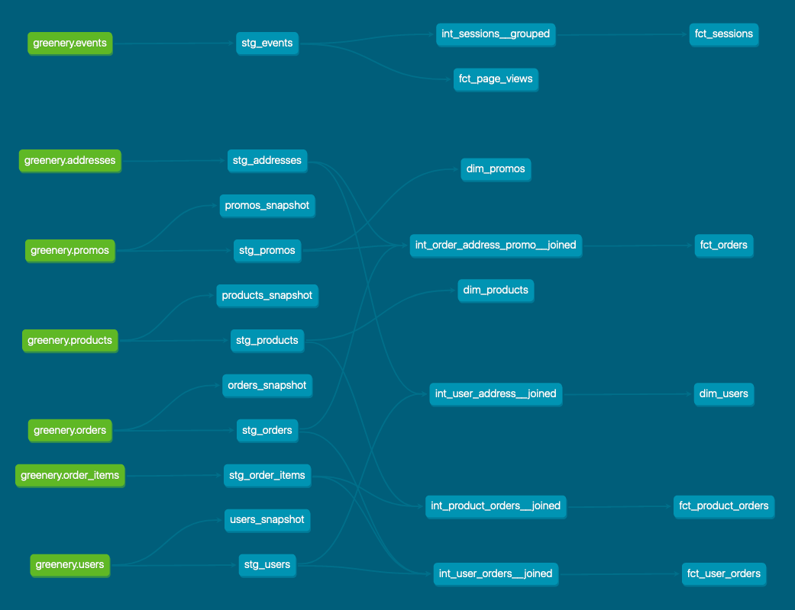

# What is our user repeat rate?
Repeat Rate = Users who purchased 2 or more times / users who purchased

Answer: **80.5%**

Query:
``` sql
WITH orders_per_users AS (
    SELECT
        user_id,
        count(distinct order_id) AS order_count_per_user
    FROM dbt_marco_g.stg_orders
    GROUP BY 1
),
users_counts AS (
    SELECT
        count(user_id) AS users_who_purchased_count,
        sum(
            CASE
                WHEN order_count_per_user >= 2 THEN 1
                ELSE 0
            END
        ) AS users_who_purchased_2_or_more_count
    FROM orders_per_users
)
SELECT
    users_who_purchased_2_or_more_count / users_who_purchased_count::float * 100.0
FROM users_counts;
```

# What are good indicators of a user who will likely purchase again? What about indicators of users who are likely NOT to purchase again? If you had more data, what features would you want to look into to answer this question?
To find out good indicators of user who will likely/likely NOT purchase again I will perform exploratory analyses on the following aspects:

- number of items per orders;
- frequency of purchase, define as the time between two subsequent orders;
- time spent on the website;
- permanence of a product in the cart;
- number of view of a given product.

If I had more data, I would like to have information about:

- user (customer) satisfaction, such as a feedback about the delivery, the products
    or the company (NPS, i.e. Net Promoter Score);
- referral program, because a user inviting other persons is more likely to purchase again.

# Explain the marts models you added. Why did you organize the models in the way you did?
Marts models are grouped by business unit:

- Core, which contains models that are important to all the business.
- Marketing;
- Product.

For each unit there is a dedicated folder containing models and an `intermediate` folder
containing models used to join and group staging models.

## Core
- **intermediate**
    - `int_order_address_promo__joined`: intermediate model joining an order with its delivery address and its discount (if any);  
    - `int_user_address__joined`: intermediate model joining an user with her/his residential address;
- `dim_products`: Dimensional model of products, which is a slowly changing dimension of type 1 (wrt `price`);
- `dim_promos`: Dimensional model of promos;
- `dim_users`: Dimensional model of users, which is a slowly changing dimension of type 1 (wrt `email`, `phone_number` and `address`);
- `fct_orders`: Fact model of orders.
## Marketing
- **intermediate**
    - `int_product_orders__joined`: intermediate model joining a product with every order where it was present; 
    - `int_user_orders__joined`: intermediate model joining an user with every order she/he placed;
- `fct_product_orders`: Fact model containing order information at the product level, useful to
    understand which are the best-selling products;
- `fct_user_orders`: Fact model of containing order information at the user level, useful to
    understand the shopping behaviour of a users.
## Product
- **intermediate**
    - `int_sessions__grouped`: intermediate model grouping events by session_id;
- `fct_page_views`: Fact model of page views, useful to understand which are the most viewed products;
- `fct_sessions`: Fact model of sessions, useful to understand how often and for how long a user visit the website.

# Use the dbt docs to visualize your model DAGs to ensure the model layers make sense 


# What assumptions are you making about each model? (i.e. why are you adding each test?)
I assumed that each column in a dimension/fact model is not null, therefore I added a `not-null` test
for almost every columns.

In addition, in each fact table with a reference to another entity, I added a `relationships` test for
the id of the entity because I assumed that there is no dangling reference.

Finally, for columns containing quantities or costs/prices, I added a `positive_values` test because
logically these values have to be positive.

# Did you find any “bad” data as you added and ran tests on your models? How did you go about either cleaning the data in the dbt model or adjusting your assumptions/tests?
In the source data I found the following isseus:

- in `orders` there are rows with `created_at` at `NULL`, I kept these rows in the staging models but removed
    them in the marts models;
- in `events` there are rows with `created_at` at `NULL`, the same of above;
- in `orders` there is a row with `order_total < 0`, I changed my assumption and removed the tests;
- in `events` there are rows where the same `session_id` is associated with different `user_id`, this should
    not happen and so I removed these rows in `fct_sessions` model.

# Your stakeholders at Greenery want to understand the state of the data each day. Explain how you would ensure these tests are passing regularly and how you would alert stakeholders about bad data getting through.
I would define a pipeline with these two steps:

- `dbt run` (follows by)
- `dbt test`

to keep the final data up-to-date and I would setup the desired trigger in case
of failure: that can be an email, a notification on slack, the update of a status page
depending on the stakeholders.

This pipeline would run at least once a day. More than that can be useful
to quickly spot the issue.
