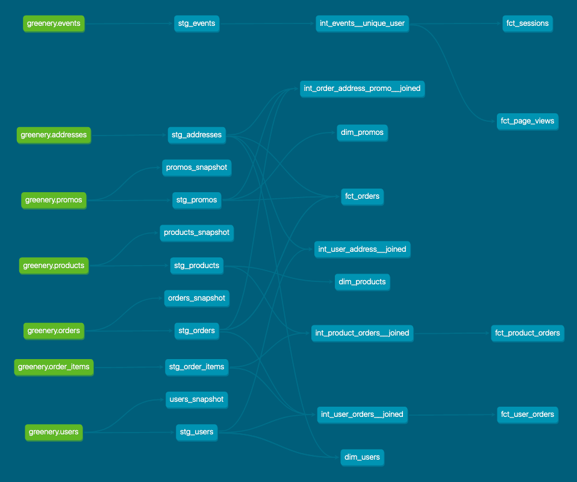

# What is our overall conversion rate?

Answer: **36.10%**

Query:
``` sql
WITH number_of_visits AS (
    SELECT count(distinct session_id) AS visit_count
    FROM dbt_marco_g.stg_events
),
number_of_conversions AS (
    SELECT count(distinct session_id) AS conversion_count
    FROM dbt_marco_g.stg_events
    WHERE event_type = 'checkout'
)
SELECT
    round(conversion_count / visit_count::numeric * 100, 2) AS conversion_rate
FROM
    number_of_visits,
    number_of_conversions;
```

# What is our conversion rate by product?

Answer:
|    product_name     | number_of_visits | number_of_conversions | conversion_rate |
|---------------------|------------------|-----------------------|-----------------|
| Monstera            |               27 |                    18 |      **66.67%** |
| Orchid              |               36 |                    23 |      **63.89%** |
| Peace Lily          |               27 |                    17 |      **62.96%** |
| String of pearls    |               41 |                    25 |      **60.98%** |
| Majesty Palm        |               37 |                    22 |      **59.46%** |
| ZZ Plant            |               39 |                    23 |      **58.97%** |
| Birds Nest Fern     |               34 |                    20 |      **58.82%** |
| Bird of Paradise    |               33 |                    19 |      **57.58%** |
| Dragon Tree         |               35 |                    20 |      **57.14%** |
| Bamboo              |               37 |                    21 |      **56.76%** |
| Spider Plant        |               31 |                    17 |      **54.84%** |
| Pink Anthurium      |               35 |                    19 |      **54.29%** |
| Cactus              |               32 |                    17 |      **53.13%** |
| Fiddle Leaf Fig     |               29 |                    15 |      **51.72%** |
| Boston Fern         |               29 |                    15 |      **51.72%** |
| Calathea Makoyana   |               31 |                    16 |      **51.61%** |
| Pothos              |               24 |                    12 |      **50.00%** |
| Arrow Head          |               40 |                    20 |      **50.00%** |
| Money Tree          |               28 |                    14 |      **50.00%** |
| Snake Plant         |               33 |                    16 |      **48.48%** |
| Pilea Peperomioides |               33 |                    16 |      **48.48%** |
| Philodendron        |               34 |                    16 |      **47.06%** |
| Angel Wings Begonia |               30 |                    14 |      **46.67%** |
| Aloe Vera           |               35 |                    15 |      **42.86%** |
| Jade Plant          |               24 |                    10 |      **41.67%** |
| Ficus               |               36 |                    14 |      **38.89%** |
| Alocasia Polly      |               26 |                    10 |      **38.46%** |
| Rubber Plant        |               35 |                    13 |      **37.14%** |
| Ponytail Palm       |               30 |                    11 |      **36.67%** |
| Devil's Ivy         |               30 |                    10 |      **33.33%** |

Query:
``` sql
WITH converted_sessions AS (
    SELECT
        distinct session_id
    FROM dbt_marco_g.stg_events
    WHERE event_type = 'checkout'
),
counts_by_product AS (
    SELECT
        split_part(page_url, '/', 5) AS product_id,
        count(distinct events.session_id) AS visit_count,
        count(distinct converted_sessions.session_id) AS conversion_count
    FROM dbt_marco_g.stg_events AS events
    LEFT JOIN converted_sessions
        ON events.session_id = converted_sessions.session_id
    WHERE event_type = 'add_to_cart'
        AND split_part(page_url, '/', 4) = 'product'
    GROUP BY 1   
)
SELECT
    dim_products.name AS product_name,
    counts_by_product.visit_count AS number_of_visits,
    counts_by_product.conversion_count AS number_of_conversions,
    round(conversion_count / visit_count::numeric * 100, 2) AS conversion_rate
FROM counts_by_product
INNER JOIN dbt_marco_g.dim_products
    ON counts_by_product.product_id = dim_products.product_id
ORDER BY 4 DESC;
```

# Why might certain products be converting at higher/lower rates than others?
There can be more than one reason, for example:
- the kind of the flower/houseplant: more popular or easier to take care of;
- some products are more advertised than others.

# Show (using dbt docs and the model DAGs) how you have simplified or improved a DAG using macros and/or dbt packages.

