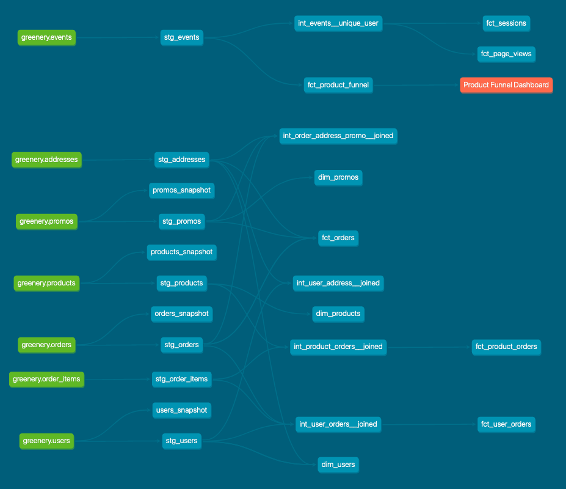

# How are our users moving through the product funnel?

Answer:
| total_rate | page_view_rate | add_to_cart_rate | conversion_rate |
|------------|----------------|------------------|-----------------|
|     100.00 |          62.82 |            54.96 |           36.10 |

Query:
``` sql
SELECT
    round(total_session_count / total_session_count::numeric * 100, 2) AS total_rate,
    round(product_page_view_session_count / total_session_count::numeric * 100, 2) AS page_view_rate,
    round(add_to_cart_session_count / total_session_count::numeric * 100, 2) AS add_to_cart_rate,
    round(checkout_session_count / total_session_count::numeric * 100, 2) AS conversion_rate
FROM dbt_marco_g.fct_product_funnel;
```

# Which steps in the funnel have largest drop off points?

Answer: The largest drop off point is between the total site visits and the product page visits.
The second larget drop off is between the add to carts and the checkouts.

Query: see the previous query

# 2A. dbt next steps for you
In my organization we are already using dbt, so I am going to recommend to improve the way our dbt repositories are organized and documented as first thing. This is due to what we studied in the second week of the course: I really appreciated the content provided concerning modeling and testing.
In addition to that, I will suggest to investigate other dbt packages to simplify our models, as we seen in the third week of the course. And, when it is possible, to leverage Jinja in models.

As far as I am concerned, I am going to improve my skill about data documentation and definition, which is an important aspect of being an analytics engineer. To do this, I am sure I will use dbt's schemas and exposures.

# DAG
